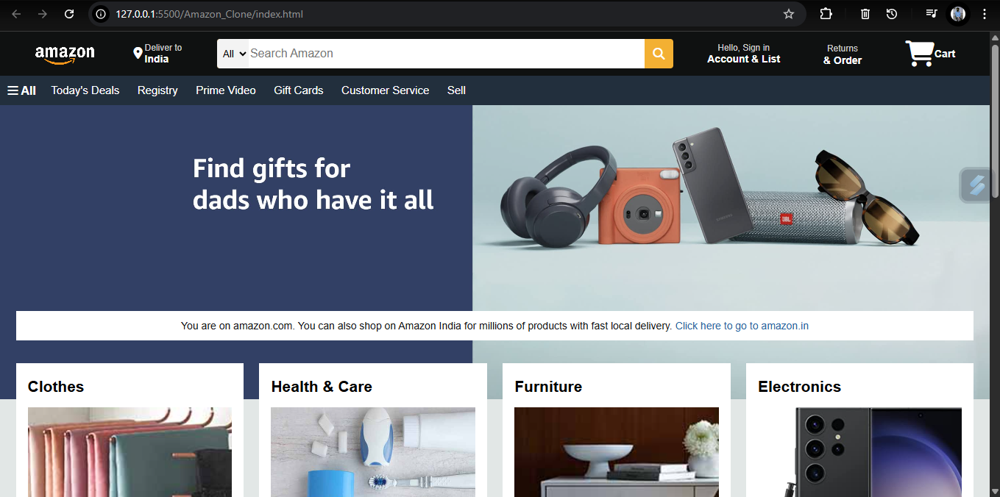
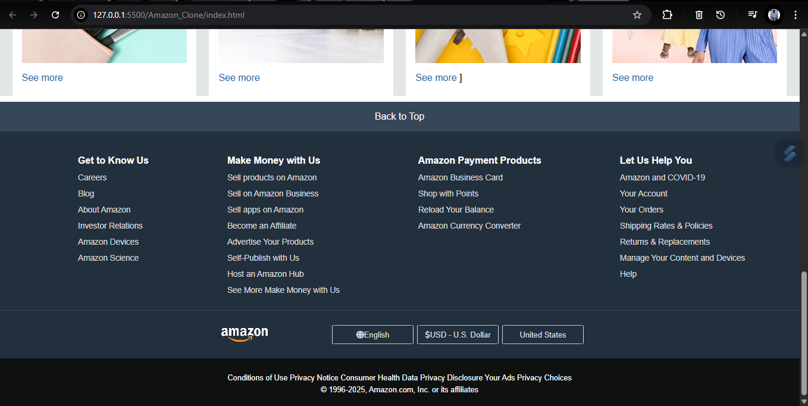

# 🛒 Amazon Clone (HTML + CSS)

A static clone of the Amazon homepage UI built using only **HTML** and **CSS**. 
This project is purely frontend and focuses on replicating the design and layout of Amazon's interface.

---

## 📸 Screenshot

---

## 🔧 Tech Stack

- 💻 HTML5  
- 🎨 CSS3  

---

## 🎯 Features

- ✅ Amazon-like homepage layout
- ✅ Header with navigation bar
- ✅ Product grid section
- ✅ Footer with links and responsive layout
- ✅ Fully static – no JavaScript, no backend

---